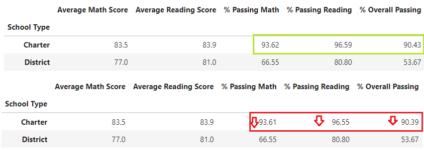

# Panda_Challenge
## 1.	Overview of the school district Analysis:
The school board asked for analysis focused on the performance of math and reading scores. However, after the school board reviewed the information obtained in the previous analysis on a set of schools, it was determined that the data from Thomas High School's 9th grade class was suspect of cheating, so for this reason is necessary to repeat the analysis of the schools based on the performance of the schools with the condition of that Thomas High School's ninth grade students should not be considered as part of the scores and it should be redefined them scores in the data.

## 2.	Results:
### o	How is the District Summary affected?

The “passing math”, “passing reading” and “overall passing” percentages are decrease, considered like the most notorious change the overall passing decrease in 0.3 percent, because the Thomas High School's ninth grade students are including in the “Total students” number but them scores are not considered for percentages of passing. 

  

### o	How is the School Summary affected?

The “average Math Score” decrease in a 0.6 percent, it affects directly in “% Passing Math” passing to the 93.27% to 93.18%. A similar case happened with “Average Reading Score” decrease in a 0.5 percent but decreasing considerably “% Passing Reading” variable in a 0.29%, finally the % Overall Passing is affected too decrease in 0.31%. 

 

### o	How does replacing the ninth graders’ math and reading scores affect Thomas High School’s performance relative to the other schools?

In general the Charter schools are directly affected by this new analysis decrease the math and reading passing percentages include the overall passing variable. 

 
### o	How does replacing the ninth-grade scores affect the following:
	Math and reading scores by grade
The most important part in the new analysis was change the ninth-grade scores of Thomas High School's to the new variable NaN (Not A Number) this would be affected the averages for the students of 9th and the general averages because we are replace a number for NaN Variable. 
 
 

### 	Scores by school spending
The spending range past of  $631-$645/student to $630-$644/student changing in a dollar in both limits, speaking in terms of money represents a significant change considering the number of students.

 

### 	Scores by school size
Thomas High School's is considered a “Medium” School because they have 1635 students, for this reason the changes in the analysis for this school affects schools of the same size decreasing the percentages of passing include the overall passing. 

 
### 	Scores by school type
Thomas High School's is defined a “Charter” School and the changes suffered in the a analysis affects schools of the same “Type” decreasing the percentages of passing include the overall passing, similar case happened in the Scores by school size.
 

## 3.	Summary:
* District summary “overall passing percentage” decrease in 0.3 % 
* In the school summary “the overall passing percentage” decrease in 0.31%.
* The spending range past of $631-$645 per student to $630-$644 per student.
* The schools considered like medium size and Charter Type are affected.

